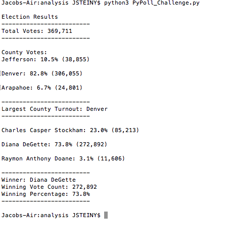

# Election-Analysis

## Overview of Project

The purpose of this challenge was to automate the results of a Colorado election, and determine which counties voted, how many votes each county had, who were the candidates, and how many votes each candidate received. 

## Election-Audit Results
* In this Congressional Election, 369,711 votes were casted.
* 3 counties were involved in this election: Jefferson, Denver, and Arapahoe. Denver made up 82.8% of the votes, casting 306,055. Jefferson made up 10.5% with 38,855 votes. Finally Arapahoe had 24,801 votes, making up the last 6.7%.
* Denver had the largest number of votes by a significant amount.
* The three candidates running in this election were Charles Casper Stockham, Diana Degette and Raymon Anthony Doane. Stockham received 85,213 votes, making up 23% of the votes, while Raymon Anthony Doane only had 11,606 votes, 3.1%. The rest of the votes went to Diana DeGette.
* Diana DeGette ran away with election, getting 272,892 votes which made up 73.8% of all votes.

## Election-Audit Summary
The code used for this Congressional Election can be used to automate the results for any election. If the CSV file follows the same set up of columns as this one, the code will be able to automate the results per location and overall votes for every candidate.

### Examples to modify script
1. If states were added to the voting count on top of counties, we would have to add state count to the algorithm. This would not be very difficult considering it would almost be the same code as counting up the counties. With some minor adjustments, adding states to the count would not be a problem. Adding cities or larger regions would be the same minor fix.
2. If ranked choice voting was an option, a way to modify the code would be to set up different columns for each voter's 1st, 2nd, 3rd, etc. choice and put a different weight to each rank. This way, we could still calculate the results as weighted scores instead of a count.
